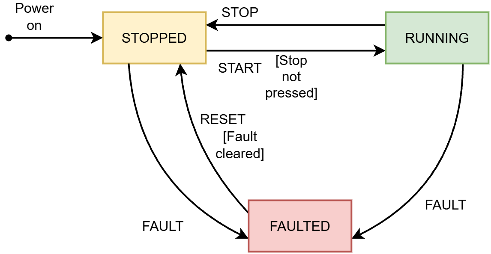
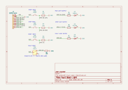

# OpenPLC ESP32 Fault Stack Light

**PLC Programming, OpenPLC, ESP32, Ladder Logic**

A PLC-style machine stack light built on an ESP32 running OpenPLC. Green means running, yellow means stopped, and red means faulted. A seal-in circuit gives Stop and Fault priority over Start, and a fault latches, so the machine can't restart until the fault is cleared and someone presses Reset.

---

## Contents

- [Demo](#demo)
- [State Diagram](#state-diagram)
- [Hardware](#hardware)
- [Wiring](#wiring)
- [Pin Selection](#pin-selection)
- [I/O Table](#io-table)
- [Ladder Program](#ladder-program)
- [How It Works](#how-it-works)
- [Testing](#testing)
- [Problems and Fixes](#problems-and-fixes)
- [Design Notes](#design-notes)
- [Limitations](#limitations)
- [What I Learned](#what-i-learned)
- [Files](#files)

---

## Demo

\\INSERT DEMO TEST VIDEOS

--- 

## State Diagram

I drew the state diagram before wiring anything or writing any ladder logic.

| Transition | From | To |
|------------|------|----|
| Power on | | STOPPED |
| Start [Stop not pressed] | STOPPED | RUNNING |
| Stop | RUNNING | STOPPED |
| Fault | STOPPED | FAULTED |
| Fault | RUNNING | FAULTED |
| Reset [Fault cleared] | FAULTED | STOPPED |

There is no path between FAULTED and RUNNING in either direction. A fault can't be skipped, and Reset never restarts the machine on its own.

| State | Light | Meaning | 
|-------|-------|---------|
| STOPPED | Yellow | Idle and ready. The machine powers on in this state. | 
| RUNNING | Green | Operating normally | 
| FAULTED | Red | Something went wrong. Locked until cleared and reset. | 

---

## Hardware

| Part | Qty | Purpose | 
|------|-----|---------|
| ESP32 dev board (ELEGOO) | 1 | Runs the OpenPLC runtime | 
| Pushbutton, normally open | 3 | Start, Stop, and Reset | 
| Slide switch | 1 | Simulated fault sensor, wired normally closed | 
| 10 kΩ resistor | 4 | Pull-downs for all four inputs | 
| LED (green, yellow, red) | 3 | Stack light outputs | 
| 220 Ω resistor | 3 | LED current limiting, one per LED | 
| Breadboard and jumper wires | | Connections | 

---

## Wiring

*Schematic made in KiCad. Source files: [`project02-fault-stack-light.kicad_sch`](project02-fault-stack-light.kicad_sch) and [`project02-fault-stack-light.kicad_pro`](project02-fault-stack-light.kicad_pro).*

- **Buttons:** one side to 3.3 V, the other side to the GPIO pin. A 10 kΩ pull-down goes from the GPIO pin to GND.
- **Fault switch:** middle leg to GPIO 35, one outer leg to 3.3 V, the other outer leg unconnected. A 10 kΩ pull-down goes from GPIO 35 to GND. In the healthy position, the switch connects 3.3 V to the pin.
- **LEDs:** each GPIO output goes through its own resistor to the LED anode. The cathode goes to GND.
- **Power:** all inputs use the ESP32's 3V3 pin through the breadboard's power rails. VIN sits at about 5 V on USB power and is not used, because the ESP32's inputs are 3.3 V only.

\\ADD BREADBOARD PHOTO

---

## Pin Selection
I checked which ESP32 pins to avoid before picking any.

| Pins | Why I avoided them | 
|------|--------------------|
| GPIO 6 to 11 | Connected to the onboard flash memory | 
| GPIO 0, 2, 5, 12, 15 | Strapping pins that set how the chip boots | 
| GPIO 1, 3 | USB serial, used for uploading and debugging | 
| GPIO 5, 14 | Output a signal during boot, which could flicker a stack light at power-up | 

A flickering green light when the machine powers up would tell an operator the machine is running when it isn't, so I kept the outputs off any pin that outputs a signal during boot.

**Inputs:** GPIO 34, 35, 36 (VP), 39 (VN) are input-only and have no internal pull resistors. Since I use external pull-downs anyway, they're a good fit for buttons, and they leave the normal pins free for outputs.

**Why Fault is on GPIO 35:** Espressif's errata notes that GPIO 36 and 39 can be pulled low for a very short time under certain conditions. Start, Stop, and Reset read 0 when not pressed, so a low glitch changes nothing for them. Fault reads 1 when healthy, so a low glitch would look like a real fault. Because the fault latches, one bad reading would stop the machine and require a reset. Fault goes on GPIO 35 to avoid that.

**Outputs:** GPIO 16, 17, 18 have no boot behavior. On my board, GPIO 16 and 17 are labeled RX2 and TX2.

---

## I/O Table

| Device | Type | ESP32 Pin | PLC Address | Variable | 
|--------|------|-----------|-------------|----------|
| Start button | Digital Input | GPIO 36 (VP) | %IX0.0 | START | 
| Stop button | Digital Input | GPIO 39 (VN) | %IX0.1 | STOP | 
| Reset button | Digital Input | GPIO 34 | %IX0.2 | RESET | 
| Fault switch | Digital Input (NC) | GPIO 35 | %IX0.3 | FAULT |
| Green LED | Digital Output | GPIO 16 (RX2) | %QX0.0 | GREEN_LED | 
| Yellow LED | Digital Output | GPIO 17 (TX2) | %QX0.1 | YELLOW_LED | 
| Red LED | Digital Output | GPIO 18 | %QX0.2 | RED_LED | 
| Running state | Internal BOOL | | | RUN | 
| Faulted state | Internal BOOL | | | FAULTED | 

There's no internal bit for STOPPED. The machine is stopped whenever it's not running and not faulted, so the yellow light uses normally closed RUN and FAULTED contacts instead of its own bit.

The pin mapping is saved in [`openplc-project/devices/pin-mapping.json`](openplc-project/devices/pin-mapping.json).

---

## Ladder Program

### Control logic

*Rung 1 latches the fault. Rung 2 is the run seal-in, blocked by Stop and by a fault.*

### Outputs

*Rungs 3 to 5 drive the green, yellow, and red lights from the RUN and FAULTED bits.*

---

## How It Works

**Rung 1: Fault latch.** The `FAULT` input reads 1 when everything is healthy, so the normally closed `FAULT` contact in the ladder is open and `FAULTED` stays off. When a fault happens, or the wire breaks, the input drops to 0. The contact closes and turns `FAULTED` on. A seal-in branch with a `FAULTED` contact keeps it on after that, even if the fault goes away. `RESET` is a normally closed contact in series with `FAULTED` inside the seal branch, so pressing Reset breaks the seal. But if the fault is still active, the top branch keeps `FAULTED` on no matter what Reset does. Reset only works once the fault is actually cleared.

**Rung 2: Run seal-in.** Pressing Start turns on `RUN`, and a `RUN` contact in parallel with Start holds it on after Start is released. `STOP` and `FAULTED` are normally closed contacts in series after the seal-in. If either one turns on, the rung breaks and `RUN` drops. This gives Stop and a fault priority over Start, and it also keeps Start from doing anything while the machine is faulted.

**Rung 3: Green light.** A normally open `RUN` contact turns on `GREEN_LED` whenever the machine is running.

**Rung 4: Yellow light.** Normally closed `RUN` and `FAULTED` contacts in series turn on `YELLOW_LED` only when the machine is not running and not faulted. That's the STOPPED state, so it doesn't need its own bit.

**Rung 5: Red light.** A normally open `FAULTED` contact turns on `RED_LED`. Because it follows the latched bit and not the `FAULT` input, the red light stays on until the fault is cleared and Reset is pressed.

---

## Testing
### I/O checkout
Before writing any ladder logic, I verified every input and output with a multimeter, so any later problem would be in the logic and not the wiring. 

| Input | Released/Healthy | Pressed/Faulted | Result | 
|-------|------------------|-----------------|--------|
| Start | 0 V | 3.3 V | Pass | 
| Stop | 0 V | 3.3 V | Pass | 
| Reset | 0 V | 3.3 V | Pass | 
| Fault | 3.3 V | 0 V | Pass | 

Each LED was tested by moving its jumper from the GPIO pin to the 3.3 V rail. All three lit. The power rails measured 3.3 V.

### Logic tests

| # | Test | Expected | Result | 
|---|------|----------|--------|
| 1 | Power on | Yellow only | | 
| 2 | Press Start | Green only | | 
| 3 | Press Stop while running | Yellow only | | 
| 4 | Slide Fault while running | Red only, green turns off | | 
| 5 | Slide Fault while stopped | Red only | | 
| 6 | Press Reset with Fault still active | Red stays on | | 
| 7 | Clear Fault, then press Reset | Yellow, not green | | 
| 8 | Press Start while faulted | Nothing happens | | 
| 9 | Hold Start and Stop together | Stays yellow | | 

---

## Problems and Fixes

### 1. All inputs read 3.3 V all the time
- **Problem:** During I/O checkout, Start, Stop, and Reset all read 3.3 V, and the reading didn't change when I pressed the buttons.
- **Cause:** I was measuring on the 3.3 V side of the button instead of the GPIO input side. The wiring was fine.
- **Fix:** I moved the probe to the row where the GPIO jumper and pull-down resistor meet. The inputs read 0 V released and 3.3 V pressed.

### 2. LEDs mapped as inputs
- **Problem:** When I set up the pin mapping in OpenPLC, I set the three LED pins as Digital Input. That gave them %IX addresses, so the ESP32 would have read those pins instead of driving them.
- **Fix:** I changed them to Digital Output, which gave them %QX0.0 to %QX0.2. I caught it before uploading.

### 3. Compile error from board labels
- **Problem:** The program failed to compile with errors like 'VP' was not declared in this scope.
- **Cause:** I entered the board's printed labels (VP, VN, RX2) as pin names. OpenPLC turns the pin mapping into C code, and the compiler only understands plain GPIO numbers.
- **Fix:** I changed every pin to its GPIO number (36, 39, 34, 35, 16, 17, 18), and it compiled.

---

## Design Notes

### Fail-safe fault input
The fault input is wired normally closed, so it reads 1 when everything is healthy. A real fault drops it to 0, and so does a broken wire. Either way, the machine faults. If the fault input were normally open, a broken wire would look exactly like "no fault," and a real problem could go unnoticed.

The 10 kΩ pull-down is what makes this work. When the switch opens or the wire breaks, the pull-down drags the pin to 0. Without it, the pin would float and could read 1, which looks healthy.

### Why a slide switch for the fault
A real fault, like a jam, stays until someone clears it. A slide switch stays in the fault position until I slide it back, which lets me properly test that Reset only works after the fault is cleared.

### Reset only works once the fault is cleared
Reset sits only in the seal branch of the fault latch. If the fault is still active, the top branch keeps FAULTED on no matter what Reset does. That builds the Reset [fault cleared] rule from the state diagram without any extra contacts.

### Fault rung comes first
PLCs scan rungs top to bottom. Putting the fault latch first means FAULTED is already updated before the RUN rung checks it in the same scan.

### Power-up in STOPPED
The machine always powers up in STOPPED. After a power outage, nothing should start moving on its own. Someone could be reaching into the machine when power returns.

### Reset goes to STOPPED, not RUNNING
After a fault, an operator has to press Start on purpose to run again. Reset only clears the fault.

---

## Limitations

**Stop is still normally open.** Unlike the fault input, the Stop button isn't fail-safe. A broken Stop wire would read the same as "not pressed."

**The fault is simulated.** A slide switch stands in for a real sensor like a jam detector, overload relay, or guard door switch.

**This isn't an emergency stop or industrial hardware.** A real E-stop uses a hardwired safety circuit. Industrial PLCs usually use 24 VDC isolated I/O, and the ESP32 runs 3.3 V logic.

---

## What I Learned
- How to design a state diagram before writing logic
- How to pick safe ESP32 pins and why some pins cause boot problems
- Why fault inputs are wired normally closed
- How to build a fault latch that only resets after the fault clears
- How to do an I/O checkout before programming
- The difference between how an input is wired (NC switch) and how the ladder reads it (NC contact reacts to the bit, not the wiring)

---

## Files

| File | Description | 
|------|-------------|
| openplc-project/ | Full OpenPLC Editor project (open this folder in OpenPLC Editor) | 

